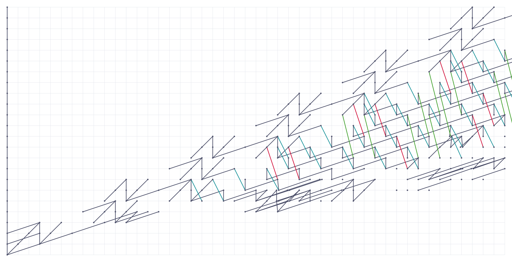
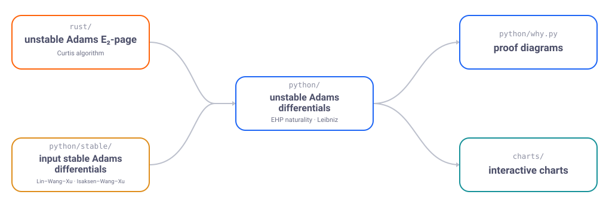

# Adams-EHP

Companion code and data for the preprint *Automated proofs of unstable Adams
differentials*. The two work products are the paper, available
as a PDF in [`paper/`](paper/lambda.pdf), and the interactive
unstable Adams charts with proof diagrams for each differential.

<p align="center">
  <a href="https://jfbaer.github.io/adams-ehp/">
    <picture>
      <source media="(prefers-color-scheme: dark)" srcset=".github/assets/chart-hero-mocha.svg">
      
    </picture>
  </a>
</p>

<p align="center">
  <sub>above: the unstable Adams spectral sequence for S⁵ with differentials
  through the 45-stem</sub>
</p>

<p align="center">
  <a href="https://jfbaer.github.io/adams-ehp/">
    
  </a>
</p>

## The idea

The propagator takes the stable Adams differentials for the sphere and the
cofiber of 2, available from Weinan Lin's
[machine-verified computations](https://arxiv.org/abs/2412.10876)
(Lin–Wang–Xu; data on
[Zenodo](https://doi.org/10.5281/zenodo.14875701)), and uses naturality of
the EHP maps and the unstable Leibniz rule to compute *unstable* Adams
differentials.

Concretely: a Rust implementation of the Curtis algorithm computes the E₂
page of the unstable Adams spectral sequence for every sphere at once (the
lambda algebra), together with the maps connecting neighboring spheres. A
SageMath engine then treats each unknown unstable Adams differential as an
affine subspace of possible matrices and shrinks those subspaces by
intersecting with constraints imposed by the algebraic EHP maps and algebraic
compositions, recording a replayable proof chain for each deduction. The
method is developed in Section 3 (*The computation of unstable Adams
differentials*) of the [preprint](paper/lambda.pdf).

<p align="center">
  <picture>
    <source media="(prefers-color-scheme: dark)" srcset=".github/assets/flow-mocha.svg">
    
  </picture>
</p>

## Quick start: reproduce the computation

With a Rust toolchain (`cargo`) and [SageMath](https://doc.sagemath.org/html/en/installation/)
9.0+ on your `PATH`, two commands run the whole pipeline:

```bash
( cd rust   && cargo run --release -- generate -d 51 -o ../build/E2_51 )
( cd python && sage -python run.py 50 --data ../build/E2_51 )
```

The first generates the E2 page and its product tables (Curtis
algorithm); the second computes the d2–d8 differentials and chart CSVs
(into `python/charts/`). The loader reads the generated table's actual
coverage and lowers its bound to fit, so the two degrees need not be
matched by hand (a `-d N` table supports propagation through total degree
`N - 1`). Bound 50 takes about ten minutes (the sage stage dominates);
the shipped dataset's full
range is total degree 76, reproducible with `-d 77` / `run.py 76` (the
rust and python stages each take several hours). The shipped data is
never modified; the fresh E2 lands in `build/`, and the propagator caches
d2 alongside it (under `--data`), writes its d3–d8 page data to
`python/data/E{r}/`, and writes chart CSVs to `python/charts/`.

To then browse your run as interactive charts (needs
[Poetry](https://python-poetry.org/) and Python 3.11+; see
[`charts/`](charts/README.md)):

```bash
( cd charts && poetry install && poetry run python generate_charts.py --charts-dir ../python/charts )
```

(add `--sidebyside` to also build the split-screen EHP map views; they are
the slow part of a chart build. Chart pages are named per sphere and page
only, and existing pages are kept as-is on re-runs — so if you also build
the shipped dataset, give each build its own `--output-dir`.)

## Repository map

| Directory | What it is |
|---|---|
| [`rust/`](rust/) | the unstable Adams E₂-page: Curtis algorithm, products, EHP maps, Mahowald's map to Λ(C2) |
| [`python/`](python/) | the propagator: a SageMath engine computing d2–d8 with proof chains, plus the `why.py` proof-diagram tool |
| [`python/stable/`](python/stable/) | the stable inputs: known Adams differentials for the sphere and the cofiber of 2 (Lin–Wang–Xu, Isaksen–Wang–Xu) |
| [`data/`](data/) | the released dataset under the file names used in the preprint's Data statements (copies of `python/data/E2/`) |
| [`charts/`](charts/) | the chart generator: turns propagator CSVs into the interactive HTML charts (bundled trimmed [SeqSee](https://github.com/JoeyBF/SeqSee)) |
| [`paper/`](paper/) | the preprint: LaTeX source and [PDF](paper/lambda.pdf) |

## Citing this work

Machine-readable citation metadata is in [`CITATION.cff`](CITATION.cff). The
preprint is not yet posted; this BibTeX entry will be completed with the
arXiv ID when it is:

```bibtex
@misc{baer-adams-ehp,
  author = {Baer, Jake Francis},
  title  = {Automated proofs of unstable {Adams} differentials},
  year   = {2026},
  note   = {arXiv ID pending. Code and data: \url{https://github.com/jfbaer/adams-ehp}}
}
```

## License and acknowledgments

Licensed under the Apache License, Version 2.0; see [`LICENSE`](LICENSE).

The chart renderer is a trimmed, bundled copy of
[SeqSee](https://github.com/JoeyBF/SeqSee) by Joey Beauvais-Feisthauer and
Dan Isaksen (its license ships in [`charts/seqsee/LICENSE`](charts/seqsee/LICENSE)). The stable
Adams differentials seeding the propagator come from the machine-verified
computations of Weinan Lin, Guozhen Wang, and Zhouli Xu
([arXiv:2412.10876](https://arxiv.org/abs/2412.10876),
[Zenodo](https://doi.org/10.5281/zenodo.14875701)).
