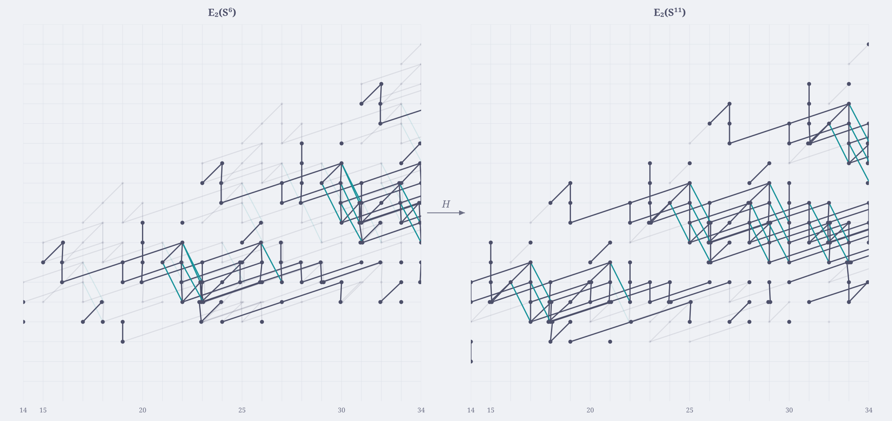

# Interactive Adams charts

The generator behind the hosted charts at
[jfbaer.github.io/adams-ehp](https://jfbaer.github.io/adams-ehp/): every
sphere, pages E2–E8, with pan/zoom, keyboard navigation, and split-screen
views of the EHP maps. The chart conventions are described in the
[preprint](../paper/lambda.pdf), Section 4.5, *Unstable Adams charts*.

<p align="center">
  <a href="https://jfbaer.github.io/adams-ehp/S6_E2_Hsbs.html">
    <picture>
      <source media="(prefers-color-scheme: dark)" srcset="../.github/assets/chart-sidebyside-mocha.svg">
      
    </picture>
  </a>
</p>

It turns the per-page CSVs written by the propagator (`python/run.py` →
`write_spheres()`, e.g. `python/charts/E2_76.csv`) into interactive
spectral-sequence charts: one JSON + HTML page per sphere `S^n` per page
`E_r`, plus an `index.html` linking them all.

The rendering engine is a trimmed copy of
[SeqSee](https://github.com/JoeyBF/SeqSee) by Joey Beauvais-Feisthauer and
Dan Isaksen, bundled here as `seqsee/`; its MIT license is in
[`seqsee/LICENSE`](seqsee/LICENSE).

## Shipped data

`data/` holds the chart CSVs from the paper's computation (through total
degree 76), so the full site rebuilds in minutes with no Rust or Sage
installed:

```bash
poetry install
poetry run python generate_charts.py --sidebyside
```

(`--sidebyside` also builds the split-screen map views the `e`/`h`/`p`/`c`
keys open; leave it off for a faster charts-only build.)

Open `interactive_charts/index.html` when it finishes.

## Requirements

- Python 3.11+
- [Poetry](https://python-poetry.org/)

`poetry install` (run once, from this `charts/` directory) resolves the four
dependencies (`pandas`, `jinja2`, `jsonschema`, `compact-json`) into a
virtual environment. No lockfile is committed; the first install creates one.

## Usage

Run from this `charts/` directory (the script shells out to the bundled
`seqsee/` package, so the working directory matters):

```bash
poetry run python generate_charts.py --charts-dir data \
    --output-dir interactive_charts --mode light --max-stem 50
```

| Flag | Meaning |
|---|---|
| `--charts-dir` | where the `E{r}_{N}.csv` files live |
| `--output-dir` | where to write the charts |
| `--mode` | `light` \| `dark` \| `both` |
| `--max-stem` | clip charts at this stem (0 = full width); also sets the uniform filtration ceiling to `N − max_stem` (26 at the defaults) |

Those are the defaults (`--sidebyside` is the one opt-in; the Pages workflow
passes it). Differentials arriving from just past the stem clip are drawn as
incoming half-lines. Point `--charts-dir ../python/charts` at a fresh
propagator run instead of the shipped data. Existing output files are
detected and skipped, so re-runs only fill in what's missing; relative paths
are resolved relative to this directory.

Page names (`S{n}_E{r}.html`) do not encode which dataset they came from,
and skipped means kept-as-is — so building two different datasets into the
same `--output-dir` silently mixes them. Use a distinct `--output-dir` per
dataset, or delete the output directory when switching.

## Proof diagrams

Each nonzero differential in a chart links to its why-graph proof diagram.
The hosted site bundles the rendered SVGs, but they are not shipped in this
repository — in a local build the click-throughs point at
`python/why_graphs/`, which stays empty until you generate them (three
passes of [`python/make_why_graphs.py`](../python/make_why_graphs.py):
`--page r`, then `--render-svg`, then `--merge-manifest`; see
[`python/README.md`](../python/README.md)).

## Input format

The generator auto-detects the per-page CSVs **`E{r}_{N}.csv`** in
`--charts-dir` (the propagator's `write_spheres()` output), where `{r}` is
the page number and `{N}` the max total degree of the run. Each row is one
element:
coordinates `(n, stem, Adams filtration)`, products with `h_i`, map images
(E/H/P/C2), differential target, and uncertainty info.

## Navigation controls (in each chart)

| Key | Action |
|---|---|
| `s` / `w` | next / previous sphere (n ± 1) |
| `d` / `a` | next / previous page (E_{r±1}) |
| `e`, `h`, `p`, `c` | open the E / H / P / C2 map in a synced split-screen view |
| `E`, `H`, `P`, `C` | same, with the map image pre-highlighted |
| `0` | reset pan/zoom |

In a split-screen view, hovering a source class highlights its image,
`t`/`T` cycle the color theme, and pressing the same key that opened the
view (or `Esc`) returns to the single chart.

---

<sub>Part of [adams-ehp](../README.md). [Curtis algorithm](../rust/README.md) → [propagator](../python/README.md) → <b>charts</b>.</sub>
