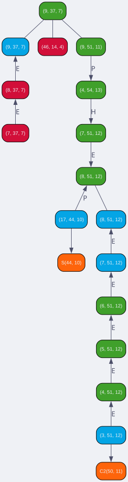

# The computation of unstable Adams differentials

The propagator takes stable Adams differentials for the sphere and the
cofiber of 2 (available from Weinan Lin's
[machine-verified computations](https://arxiv.org/abs/2412.10876),
Lin–Wang–Xu) and uses naturality of the EHP maps and the unstable
Leibniz rule to compute *unstable* Adams differentials.

Each unknown unstable Adams differential is held as an affine subspace of possible matrices;
every constraint (a naturality square, a Leibniz pairing, d² = 0) intersects
that subspace, and every intersection that shrinks it is recorded, so each
deduced differential carries a full, replayable proof chain.

`compute()` takes the E2 page and maps from [`data/E2/`](data/E2/) (generated
by [`../rust/`](../rust/)) and the known stable and C2 differentials from
[`stable/`](stable/), and writes the deduced d_r with proof chains to
`data/E{r}/d{r}` and chart CSVs to `charts/`. `why.py` renders the proof
chain for any deduced differential as a diagram. The propagation method is
developed in the [preprint](../paper/lambda.pdf), §*The computation of unstable Adams
differentials*.

## Requirements

- **SageMath 9.0+** (finite field linear algebra):
  https://doc.sagemath.org/html/en/installation/
- **Graphviz** (optional), to render proof diagrams from `why.py`

## Quick start

Run from `python/`:

```bash
sage -python run.py 76                 # full shipped range (s+f ≤ 76); takes hours
sage -python run.py 50                 # reduced range, finishes quickly
sage -python run.py 50 --data my/E2    # read E2 CSVs from another directory
```

The loader reads the relations table's complete coverage band (76 for the
shipped `data/E2/`) and lowers the bound to fit, since products beyond the
band would silently read as zero. Bare `run.py` defaults to tot = 70.

Only tridegrees with `s+f ≤ tot` and `n ≤ 2·tot` are loaded; deductions
beyond those bounds would rest on incomplete data. `--data` defaults to the
shipped `data/E2/`; point it at a rust `--out-dir` to use freshly generated
data without copying.

## Where the inputs come from

**`data/E2/`, the E2 page, from the Curtis algorithm** (see
[`../rust/README.md`](../rust/README.md)):

- `E2_rank.csv`: dimension at each tridegree `(n, s, f)`, including the
  n=0 column (Lambda(C2), the target of Mahowald's map)
- `E2_relations.csv`: the multiplication (product) table
- `E2_E.csv`, `E2_H.csv`, `E2_P.csv`, `E2_C2.csv`: map data
- `E2_C2_products.csv`: filtration-1 h_i products on the Lambda(C2) column,
  from which the h0–h3 product maps are built
- `E2_names.json` (optional): each class is named by the lexicographically
  leading term of its lambda algebra cycle representative

**`stable/`, the known differentials seeding the whole computation** (see
[`stable/README.md`](stable/README.md) for format and provenance):

- `stable_sphere_diffs.csv`: entry-level stable Adams d_r for the sphere, applied
  to every sphere in the stable range (n > s+1)
- `c2_diffs.csv`: entry-level Adams d_r for the cofiber of 2, applied
  to the n=0 (Lambda(C2)) column

The input CSV files are loaded at the beginning of the computation on each
page. Everything else is derived: stabilization and the C2 map data let
`compute()` propagate the known stable differentials to the unstable range
via naturality. After `compute()` on each page r ≥ 3, the
spurious-uncertainty resolver (`spurious.py`) cleans up tridegrees that
were skipped because of ambiguities in their constraints, coming from
uncertainties about their differentials on an earlier page.

## Outputs

- `data/E{r}/d{r}` (JSON): the d_r differentials with full proof chains,
  r = 2..5 (d2 lands under `--data`)
- `data/E{r}/d{r}_unknown.csv`: tridegrees where d_r could not be fully
  determined
- `charts/E{r}_{tot}.csv`: chart data for each page (one row per
  element: coordinates, products with h_i, map images, differential target,
  and uncertainty generators); rendered by [`../charts/`](../charts/README.md)
- `data/E{r}/`: complete page data (rank, relations, maps) for r = 3..5, in
  the same per-file format as `data/E2/` (files named `E{r}_*`)

## Proof diagrams

Every deduced differential carries a proof chain (the *why graphs* of the
[preprint](../paper/lambda.pdf)). To render one:

```bash
sage -python why.py 9 37 7 -r 3     # proof of d3 at (n, s, f) = (9, 37, 7)
```

(This reads the `data/E{r}/d{r}` caches a completed `run.py` leaves behind —
they are not shipped, so run the pipeline first.)

This writes `why_9_37_7.dot` and, if graphviz is installed, renders it to
PDF. Nodes are tridegrees; terminal (orange) nodes are known stable or
Lambda(C2) differentials; edges are labeled by the map used (E/H/P), and
Leibniz steps branch to the two factors and their product. The proof of d3 at (9, 37, 7) runs fourteen deductions deep before
it terminates in the stable inputs:

<p align="center">
  <picture>
    <source media="(prefers-color-scheme: dark)" srcset="../.github/assets/why-9-37-7-mocha.svg">
    
  </picture>
</p>

## Key concepts

**Tridegrees (n, s, f):** elements are indexed by grade n (sphere), stem s,
and Adams filtration f. The differential on page r maps
`d_r: E_r^{n,s,f} → E_r^{n,s-1,f+r}`.

**Uncertainty tracking:** when constraints determine a differential only up
to a subspace, the engine stores the definite part (offset) and the
generators of the remaining indeterminacy, and keeps refining both as more
constraints arrive. (See §*Uncertainties* in the [preprint](../paper/lambda.pdf).)

## Modules

- `run.py`: the computation pipeline (start here)
- `ehp_adams.py`: `SpectralSequencePage` / `SpectralSequence`, constraint
  solving and page transitions
- `differentials.py`: `DifferentialsPage`, differentials as affine matrix
  subspaces, proof chains
- `lib.py`: `Element`, `Map`, `AffineMatrixSubspace`, and file I/O
- `uncertainty.py`: `UncertaintyManager`, indeterminacy bookkeeping
- `spurious.py`: the spurious-uncertainty resolver run after each page
- `why.py`: proof-diagram CLI; `make_why_graphs.py` renders every proof to
  SVG for the browser in `why_graphs/`, in three passes per page:

  ```bash
  sage -python make_why_graphs.py --page 2   # proof trees -> DOT (needs sage; repeat per page)
  python3 make_why_graphs.py --render-svg    # DOT -> SVG (parallel, needs graphviz)
  python3 make_why_graphs.py --merge-manifest  # build the viewer's manifest.js
  ```

---

<sub>Part of [adams-ehp](../README.md). [Curtis algorithm](../rust/README.md) → E2 data → <b>propagator</b> → [charts](../charts/README.md).</sub>
